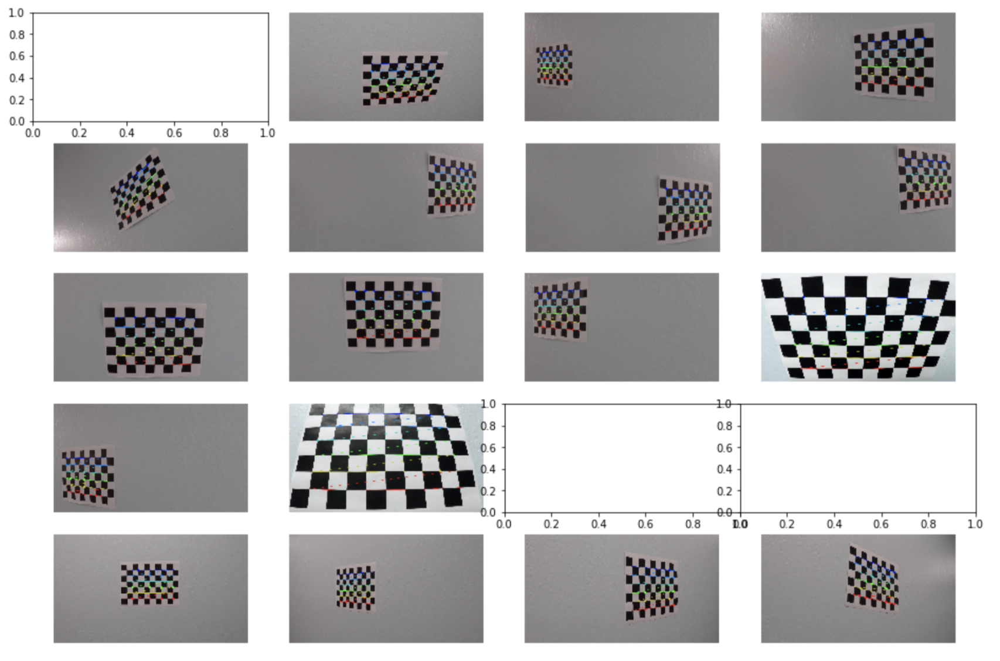
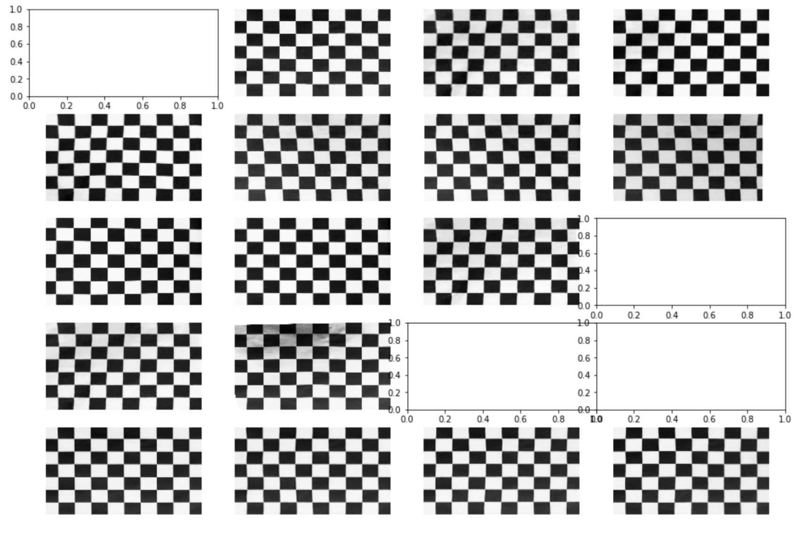
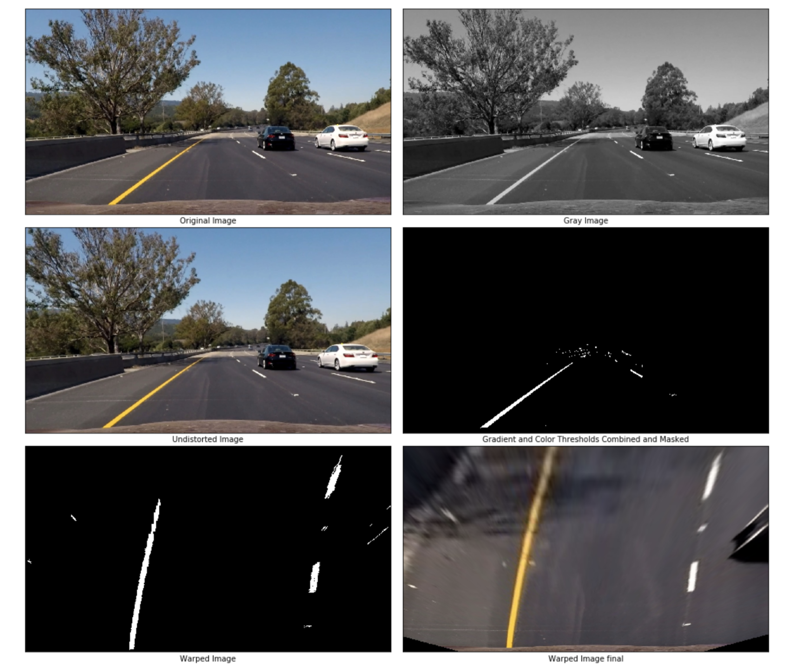
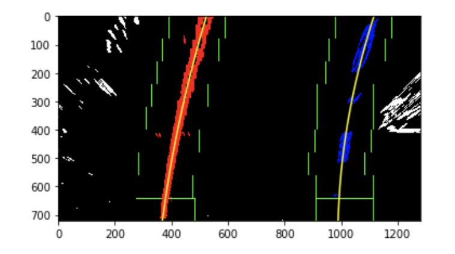
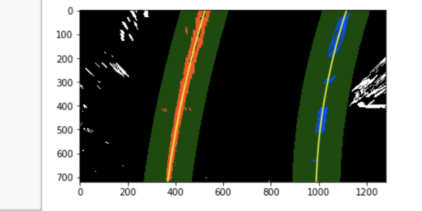
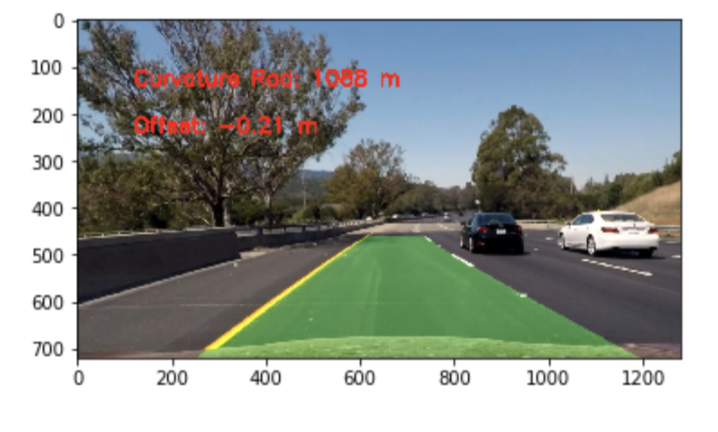
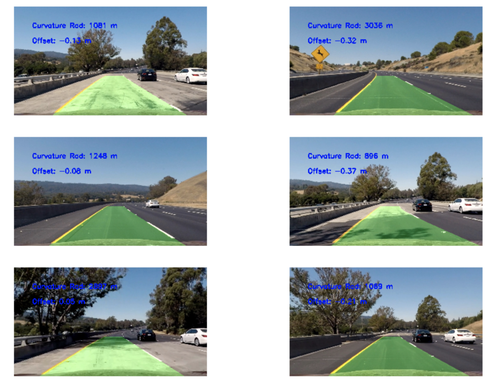

## Writeup Project 4
## Advanced Lane Detection
Ray Khorsandi

January 2017

---

**Advanced Lane Finding Project**

The goals / steps of this project are the following:

* Compute the camera calibration matrix and distortion coefficients given a set of chessboard images.
* Apply a distortion correction to raw images.
* Use color transforms and gradients, to create a thresholded binary image.
* Apply a perspective transform to rectify binary image ("birds-eye view").
* Detect lane pixels and fit to find the lane boundary.
* Determine the curvature of the lane and vehicle position with respect to center.
* Warp the detected lane boundaries back onto the original image.
* Output visual display of the lane boundaries and numerical estimation of lane curvature and vehicle position.


## [Rubric](https://review.udacity.com/#!/rubrics/571/view) Points

### Here I will consider the rubric points individually and describe how I addressed each point in my implementation.  

---

### Writeup / README

#### 1. Provide a Writeup / README that includes all the rubric points and how you addressed each one.  [Here](https://github.com/udacity/CarND-Advanced-Lane-Lines/blob/master/writeup_template.md) is the link to the project and the writeup for this project.

You're reading it!

### Camera Calibration

#### 1. Briefly state how you computed the camera matrix and distortion coefficients. Provide an example of a distortion corrected calibration image.

The code for this step is contained in the first code cell of the IPython notebook located in "./Advanced Lane Detection P4.ipynb".

I start by preparing "object points", which will be the (x, y, z) coordinates of the chessboard corners in the world. Here I am assuming the chessboard is fixed on the (x, y) plane at z=0, such that the object points are the same for each calibration image.  Thus, `objp` is just a replicated array of coordinates, and `objpoints` will be appended with a copy of it every time I successfully detect all chessboard corners in a test image.  `imgpoints` will be appended with the (x, y) pixel position of each of the corners in the image plane with each successful chessboard detection. This image shows the detected corners in chessboard images:



Three images are not shown since the original images miss some of the corners.


I then used the output `objpoints` and `imgpoints` to compute the camera calibration and distortion coefficients using the `cv2.calibrateCamera()` function.  I applied this distortion correction to the test image using the `cv2.undistort()` function and obtained this result: 




### Pipeline (single images)

#### 1. Provide an example of a distortion-corrected image.

To demonstrate this step, I will describe how I apply the distortion correction to one of the test images like this one:


#### 2. Describe how (and identify where in your code) you used color transforms, gradients or other methods to create a thresholded binary image.  Provide an example of a binary image result.

I used a combination of color and gradient thresholds to generate a binary image (thresholding steps in cell #3 in `Advanced Lane Detection P4.ipynb`)
I used gradient on x direction (horizontal) and gradient direction to get the edges. To detect yellow lines, R and G channels are used. Finally, S and L channels from HLS are used to detect white and bright yellow. All of these binary thresholded images are combined and then mask to get lanes as much as possible

 Here's an example of my output for this step.  



#### 3. Describe how (and identify where in your code) you performed a perspective transform and provide an example of a transformed image.

The code for my perspective transform includes a function called `warped()`, in the 4th code cell of the IPython notebook).  The `warped()` function takes as inputs an image (`gray`), as well as source (`src`) and destination (`dst`) points.  I chose the hardcode the source and destination points in the following manner:

```python
src_points = np.float32([ corners[0], corners[nx-1], corners[-1], 
                         corners[-nx]])
offset = 100
dst_points = np.float32([[offset, offset], 
                         [img_size[0]-offset, offset], 
                         [img_size[0]-offset, img_size[1]-offset], 
                         [offset, img_size[1]-offset]])

```

This resulted in the following source and destination points:

| Source        | Destination   | 
|:-------------:|:-------------:| 
| 180,   720      | 320,  720        | 
| 575,   460      | 320,    0      |
| 705,   460     | 960,   0      |
| 705,   460      | 960,  720        |

I verified that my perspective transform was working as expected by drawing the `src` and `dst` points onto a test image and its warped counterpart to verify that the lines appear parallel in the warped image.


#### 4. Describe how (and identify where in your code) you identified lane-line pixels and fit their positions with a polynomial?

Then in 10th cell code, I used histogram on the bottom half of the unwarped binary image to find the left and right line base. By using sliding window, the points related to left and right lanes are detected. 


My algorithm found some lines but I check that the detection makes sense. To confirm that detected lane lines are real:

* Checking that they have similar curvature
* Checking that they are separated by approximately the right distance horizontally
* Checking that they are roughly parallel

If sanity checks reveal that the detected lane lines are problematic for some reason, I assume it was a bad or difficult frame of video, retain the previous positions from the frame prior and step to the next frame to search again. If we lose the lines for several frames in a row, we should probably start searching from scratch using a histogram and sliding window. Even when everything is working, line detections jump around from frame to frame a bit and it can be preferable to smooth over the last n frames of video to obtain a cleaner result. Each time we get a new high-confidence measurement, we can append it to the list of recent measurements and then take an average over n past measurements to obtain the lane position we want to draw onto the image.


 

#### 5. Describe how (and identify where in your code) you calculated the radius of curvature of the lane and the position of the vehicle with respect to center.

I did this in cell 13  in my code. 

#### 6. Provide an example image of your result plotted back down onto the road such that the lane area is identified clearly.

I implemented this step in cells 15,16 and 17 in my code.  Here is an example of my result on a test image:


 

 

---

### Pipeline (video)

#### 1. Provide a link to your final video output.  Your pipeline should perform reasonably well on the entire project video (wobbly lines are ok but no catastrophic failures that would cause the car to drive off the road!).

Here's a [link to my video result](./project_video_output.mp4)

---

### Discussion

#### 1. Briefly discuss any problems / issues you faced in your implementation of this project.  Where will your pipeline likely fail?  What could you do to make it more robust?

Here I'll talk about the approach I took, what techniques I used, what worked and why, where the pipeline might fail and how I might improve it if I were going to pursue this project further.  

The main issue was finding thresholding and finding the right channels and gradients to extract lines as accurate as possible. I had to tune threshold values many times to get the best result. 

It is not reasonable to look for the lanes in the whole image. After finding the lanes in the first frame, we can use it as a base for the next frames to limit the search area with a margin. In this case, it reduces the computations and improve the speed. 

We assumed the camera is mounted at the center of the car and lines are straight, such that the lane center is the midpoint at the bottom of the image between the two lines you've detected. Sometimes these assumptions are not correct. 

