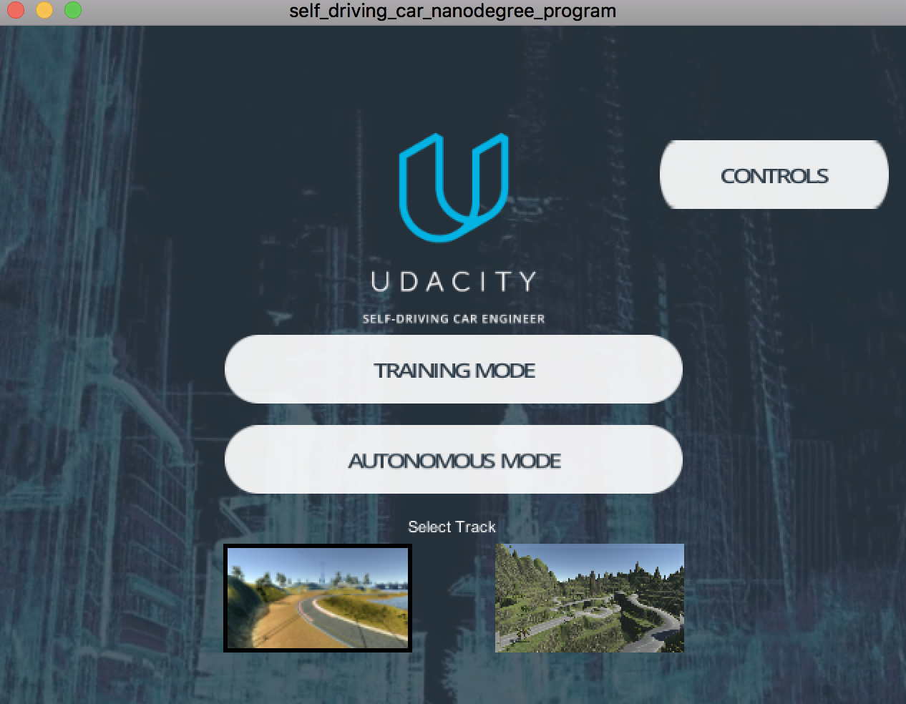
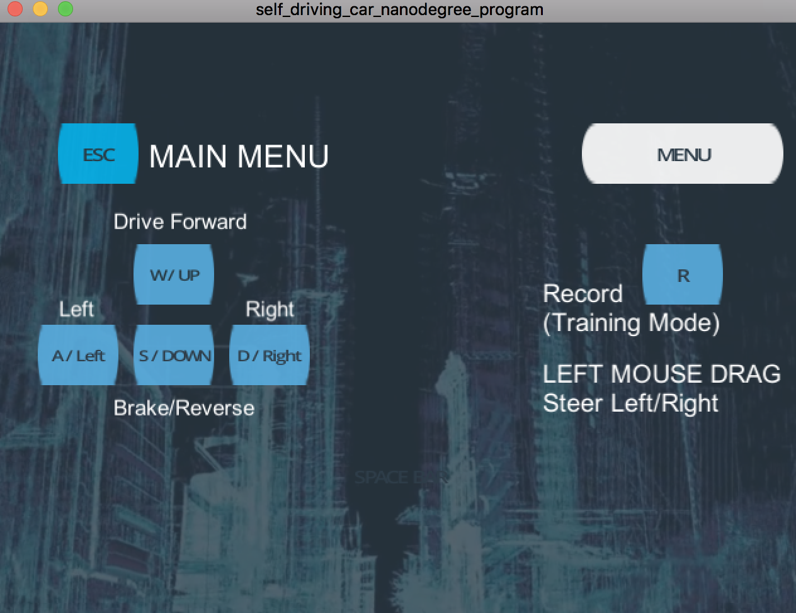
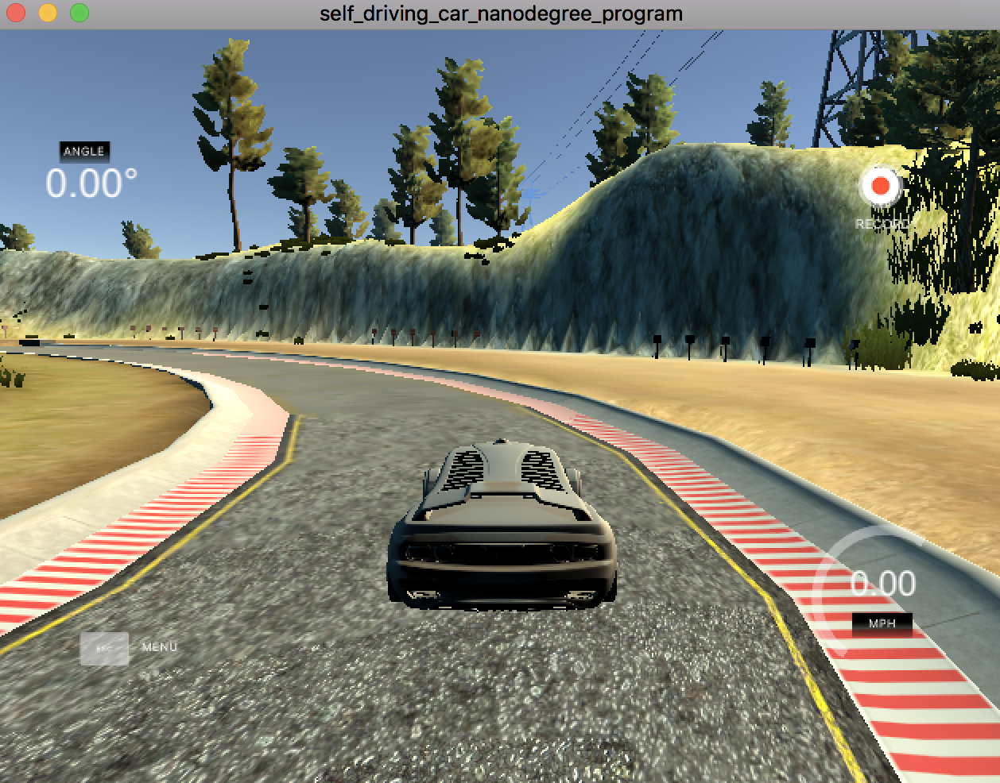
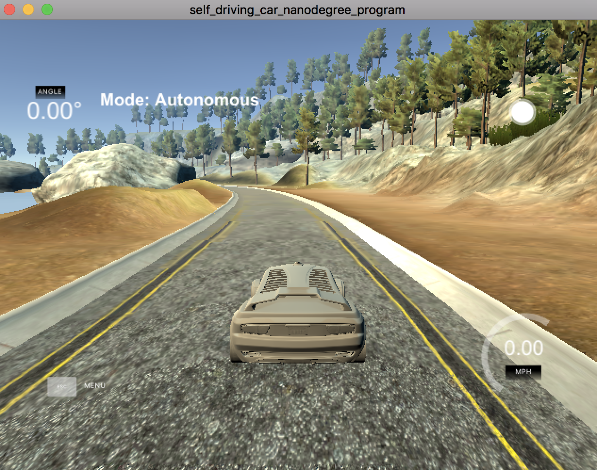
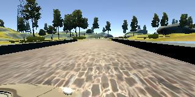
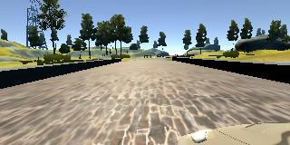
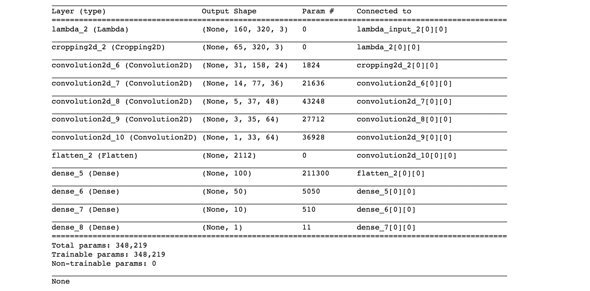
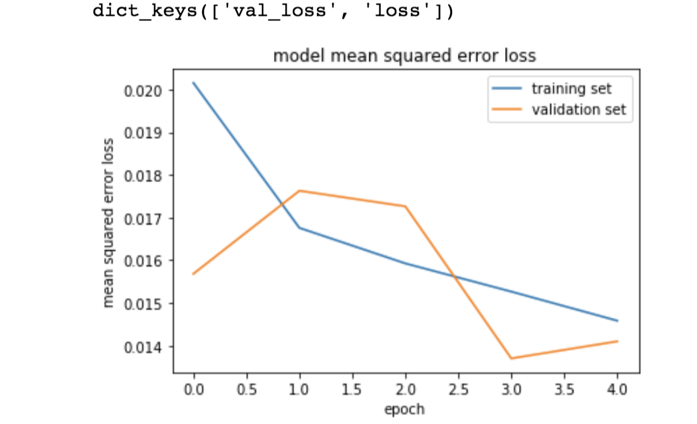

# **Self-Driving Cars Course, Behavioral Cloning, Project #3** 

Ray Khorsandi

January 2018

## Introduction

### In this project, I used deep lerning and neural networks to clone driving behavior using a simulator. Keras is used to train, validate and test a neural network model. The input of the model is center image from the car and the output is the steering angle to the autonomous car. The simulator has two modes, the training mode for collecting data  and autonomous mode to test the trained model. 

---

**Behavioral Cloning Project**

The goals of this project are the following:

* Use the simulator to collect data of good driving behavior
* Build, a convolution neural network in Keras that predicts steering angles from images
* Train and validate the model with a training and validation set
* Test that the model successfully drives around track one without leaving the road
* Summarize the results with a written report


### Simulator








### Files Submitted & Code Quality

#### 1. Submission includes all required files and can be used to run the simulator in autonomous mode

My project includes the following files:

* model_generator.py containing the script to create and train the model
* drive.py for driving the car in autonomous mode
* model.h5 containing a trained convolution neural network 
* writeup_report.md or writeup_report.pdf summarizing the results
* run1.mp4 containing the video of autonomous driving by trained model

#### 2. Submission includes functional code
Using the Udacity provided simulator and my drive.py file, the car can be driven autonomously around the track by executing to run the drive.py
```
docker run -it --rm -p 4567:4567 -v `pwd`:/src udacity/carnd-term1-starter-kit python drive.py model.h5 run1
```

and executing 


docker run -it --rm -p 4567:4567 -v `pwd`:/src udacity/carnd-term1-starter-kit python video.py run1


to run the video.py

#### 3. Submission code is usable and readable

The model.py file contains the code for training and saving the convolution neural network. The file shows the pipeline I used for training and validating the model, and it contains comments to explain how the code works.

### Model Architecture and Training Strategy

#### 1. An appropriate model architecture has been employed

My model consists of a convolution neural network with 3x3 filter sizes and depths between 32 and 128

The model includes RELU layers to introduce nonlinearity, and the data is normalized in the model using a Keras lambda layer.

#### 2. Attempts to reduce overfitting in the model


The model was trained and validated on different data sets to ensure that the model was not overfitting . The model was tested by running it through the simulator and ensuring that the vehicle could stay on the track.

#### 3. Model parameter tuning

The model used an adam optimizer, so the learning rate was not tuned manually 

#### 4. Appropriate training data

Training data was chosen to keep the vehicle driving on the road. I used a combination of center lane driving, recovering from the left and right sides of the road and smooth driving around the curves. 
 

### Model Architecture and Training Strategy

#### 1. Solution Design Approach

The overall strategy for deriving a model architecture was to use convolution neural network (CNN).

My first step was to use a convolution neural network model similar to the LeNet. I thought this model might be appropriate because it works fine on traffic sign classification.

In order to gauge how well the model was working, I split my image and steering angle data into a training and validation set. I found that my first model had a low mean squared error on the training set but a high mean squared error on the validation set. This implied that the model was overfitting. 

To combat the overfitting, I modified the model so that I added more convlutional and dense layers.

Then I augmented images by fliping the images and angles and using left and right side images.  

Center image:


Left image and flipped left image:

 

Right image and flipped right image:

 


The final step was to run the simulator to see how well the car was driving around track one. There were a few spots where the vehicle fell off the track. To improve the driving behavior in these cases, I collected more data and used augmentation by flipping images and using left and right cameras.

At the end of the process, the vehicle is able to drive autonomously around the track without leaving the road.

#### 2. Final Model Architecture

The final model architecture consisted of a convolution neural network with the following dense layers.





#### 3. Creation of the Training Set & Training Process
I collected several different kind of data by simulator such as driving in center, smooth driving by the curves, driving reverse the road and so on.

I finally randomly shuffled the data set and put 20% of the data into a validation set. 

I used this training data for training the model. The validation set helped determine if the model was over or under fitting. The ideal number of epochs was 5 as evidenced. I used an adam optimizer so that manually training the learning rate wasn't necessary.
