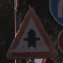

# **Traffic Sign Recognition** 

Ray Khorsandi

December 2017

## Introduction

In this project, we build a Traffic Sign Recognition. 

The steps of this project are the following:

* Load the data set 
* Explore, summarize and visualize the data set
* Design, train and test LeNet model
* Use the model to make predictions on new images from web
* Analyze the softmax probabilities of the new images
* Conclusion

## Rubric Points
### Here I will consider the [rubric points](https://review.udacity.com/#!/rubrics/481/view) individually and describe how I addressed each point in my implementation.  

---
### Writeup / README

#### 1. Provide a Writeup / README that includes all the rubric points and how you addressed each one. You can submit your writeup as markdown or pdf. You can use this template as a guide for writing the report. The submission includes the project code.

You're reading it! and here is a link to my [project code](https://github.com/khorsandi2014/Udacity_self_driving_car/tree/master/Term1/CarND-Traffic-Sign-Classifier-Project)

### Data Set Summary & Exploration

#### 1. Provide a basic summary of the data set. In the code, the analysis should be done using python, numpy and/or pandas methods rather than hardcoding results manually.

The model is trained on images from [German Traffic Sign Dataset] (http://benchmark.ini.rub.de/?section=gtsrb&subsection=dataset) and here are several samples from the dataset:

  

  

I used the pandas library to calculate summary statistics of the traffic
signs data set:

* The size of training set is 34798
* The size of the validation set is 4409
* The size of test set is 12629
* The shape of a traffic sign image is (32, 32, 3). It is a color image
* The number of unique classes/labels in the data set is 43

#### 2. Include an exploratory visualization of the dataset.

[(0, 'Speed limit (20km/h)'), (1, 'Speed limit (30km/h)'), (2, 'Speed limit (50km/h)'), (3, 'Speed limit (60km/h)'), (4, 'Speed limit (70km/h)'), (5, 'Speed limit (80km/h)'), (6, 'End of speed limit (80km/h)'), (7, 'Speed limit (100km/h)'), (8, 'Speed limit (120km/h)'), (9, 'No passing'), (10, 'No passing for vehicles over 3.5 metric tons'), (11, 'Right-of-way at the next intersection'), (12, 'Priority road'), (13, 'Yield'), (14, 'Stop'), (15, 'No vehicles'), (16, 'Vehicles over 3.5 metric tons prohibited'), (17, 'No entry'), (18, 'General caution'), (19, 'Dangerous curve to the left'), (20, 'Dangerous curve to the right'), (21, 'Double curve'), (22, 'Bumpy road'), (23, 'Slippery road'), (24, 'Road narrows on the right'), (25, 'Road work'), (26, 'Traffic signals'), (27, 'Pedestrians'), (28, 'Children crossing'), (29, 'Bicycles crossing'), (30, 'Beware of ice/snow'), (31, 'Wild animals crossing'), (32, 'End of all speed and passing limits'), (33, 'Turn right ahead'), (34, 'Turn left ahead'), (35, 'Ahead only'), (36, 'Go straight or right'), (37, 'Go straight or left'), (38, 'Keep right'), (39, 'Keep left'), (40, 'Roundabout mandatory'), (41, 'End of no passing'), (42, 'End of no passing by vehicles over 3.5 metric tons')]

This is the histogram of number of samples per class:

 

### Design and Test a Model Architecture

#### 1. Describe how you preprocessed the image data. What techniques were chosen and why did you choose these techniques? Consider including images showing the output of each preprocessing technique. Pre-processing refers to techniques such as converting to grayscale, normalization, etc. (OPTIONAL: As described in the "Stand Out Suggestions" part of the rubric, if you generated additional data for training, describe why you decided to generate additional data, how you generated the data, and provide example images of the additional data. Then describe the characteristics of the augmented training set like number of images in the set, number of images for each class, etc.)

As a first step, images are converted to grayscale to make the model robust against colors. 

Here is an example of a traffic sign image before and after grayscaling.

 

 

Then, gray scale images are normalized by (image - 128)/128 to center iamges around 0 with variance 1. Finally, images are resized to (32,32) in case they are ont in this size. 

It is an option to generate more data (data augmentation) specially for those classes with less number of samples. There are several ideas such as translation, scaling, chaning brightness, rotation and so on. However, the model works well on real data and there is no need generate more data at this point since it increases the complexity and training time. 

#### 2. Describe what your final model architecture looks like including model type, layers, layer sizes, connectivity, etc.) Consider including a diagram and/or table describing the final model.

I used the LeNet model with (32x32) inputs and 43 outputs as described:

| Layer         		|     Description	        					| 
|:---------------------:|:---------------------------------------------:| 
| Input         		| 32x32x1 Gray image   							| 
| Convolution 3x3     	| 1x1 stride, valid padding, outputs 28x28x6 	|
| RELU					|		Activation function										|
| Max pooling	      	| 2x2 stride,  outputs 14x14x6 				|
| Convolution 3x3     	| 1x1 stride, valid padding, outputs 10x10x16 	|
| RELU					|				Activation function								|
| Max pooling	      	| 2x2 stride,  outputs 5x5x16    									|
| Flatten		| Input = 5x5x16. Output = 400        									|
| Fully connected		| Input = 400 Output = 120        									|
| RELU				| Activation function
| Fully connected		| Input = 120 Output = 84        									|
| RELU				| Activation function        									|
| Fully connected		| Input = 84 Output = 43       									|
| Softmax | Classifier output = 43

#### 3. Describe how you trained your model. The discussion can include the type of optimizer, the batch size, number of epochs and any hyperparameters such as learning rate.

To train the model, I tested many different values for parameters to get the best results. For example, I started with learning rate 0.01 and I realized it is too big as the accruacy was jumping or decreasing a lot. So, I decreses the larning rate to 0.001 and then 0.0005 which gave good accuracy (95%). The other parameters are:

EPOCHS = 100, 50, 30

BATCH_SIZE = 256, 128

I used cross_entropy funciton, Adam optimizer. I made several changes to the LeNet but not much difference in the results for this project, so I removed them. Also, I used color images in the begining but the results were not promissing at all and I had to convert the images to grayscale.

#### 4. Describe the approach taken for finding a solution and getting the validation set accuracy to be at least 0.93. Include in the discussion the results on the training, validation and test sets and where in the code these were calculated. Your approach may have been an iterative process, in which case, outline the steps you took to get to the final solution and why you chose those steps. Perhaps your solution involved an already well known implementation or architecture. In this case, discuss why you think the architecture is suitable for the current problem.

My final model results were:

* training set accuracy of 98%
* validation set accuracy of 97%
* test set accuracy of 93%

First, I used LeNet and and I changes the input for color images (32x32X3) and 43 outputs. However, the accruacy was less than 60% and then I decided to convert the images to gray scale image and got 98% accuracy. 

I read the paper [Traffic Sign Recognition with Multi-Scale Convolutional Networks] (http://yann.lecun.com/exdb/publis/pdf/sermanet-ijcnn-11.pdf) and the proposed network in this paper sounds interesting but it was a bit time consuming to implement it. I think this model can generate better results as shown in the paper. There could be some improvement in the arcitecture of network for example having more filters in the begining and then using dropout for regularization. The LeNet model which is used here works fine but it is not complex enought for traffic sign classification and by adding more layers such as convolution layers, dropout, fully connected layers improve the accuracy and model.

 

There were some issues in the begining that it seems the network is not working at all and accuracy was around 0.5% and I changed the initialization values for parameters and it got better. 
 

### Test a Model on New Images

#### 1. Choose five German traffic signs found on the web and provide them in the report. For each image, discuss what quality or qualities might be difficult to classify.

Here are six German traffic signs that I found on the web:

  

  

#### 2. Discuss the model's predictions on these new traffic signs and compare the results to predicting on the test set. At a minimum, discuss what the predictions were, the accuracy on these new predictions, and compare the accuracy to the accuracy on the test set (OPTIONAL: Discuss the results in more detail as described in the "Stand Out Suggestions" part of the rubric).

Here are the results of the prediction:

| Image			        |     Prediction	        					| 
|:---------------------:|:---------------------------------------------:| 
| Speed limit (20km/h)      		| Speed limit (20km/h)   									| 
| Keep right     			|Keep right 										|
| Right-of-way at the next intersection					| Right-of-way at the next intersection											|
| Turn right ahead	      		| Turn right ahead					 				|
| Keep right		| Keep right     							|
| Vehicles over 3.5 metric tons prohibited		| Vehicles over 3.5 metric tons prohibited   

The model was able to correctly guess 4 of the 5 all of the traffic signs, which gives an accuracy of 100%. 

#### 3. Describe how certain the model is when predicting on each of the five new images by looking at the softmax probabilities for each prediction. Provide the top 5 softmax probabilities for each image along with the sign type of each probability. (OPTIONAL: as described in the "Stand Out Suggestions" part of the rubric, visualizations can also be provided such as bar charts)

| Probability         	|     Prediction	        					| 
|:---------------------:|:---------------------------------------------:| 
| 1.0         			| Speed limit (20km/h)    									| 
| 1.0     				|Keep right 											|
| 1.					| Right-of-way at the next intersection											|
| 1.0	      			|Turn right ahead					 				|
| 1.0				    | Keep right 	      							|
| 	1.0						|  Vehicles over 3.5 metric tons prohibited 

