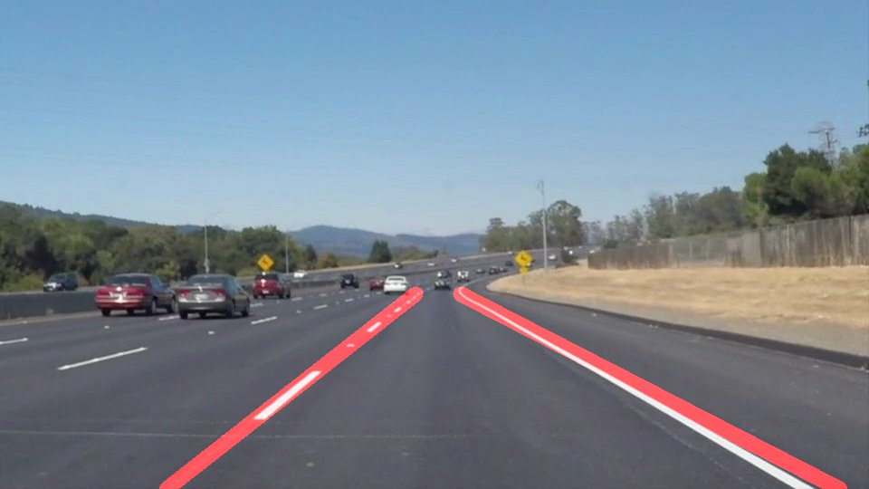
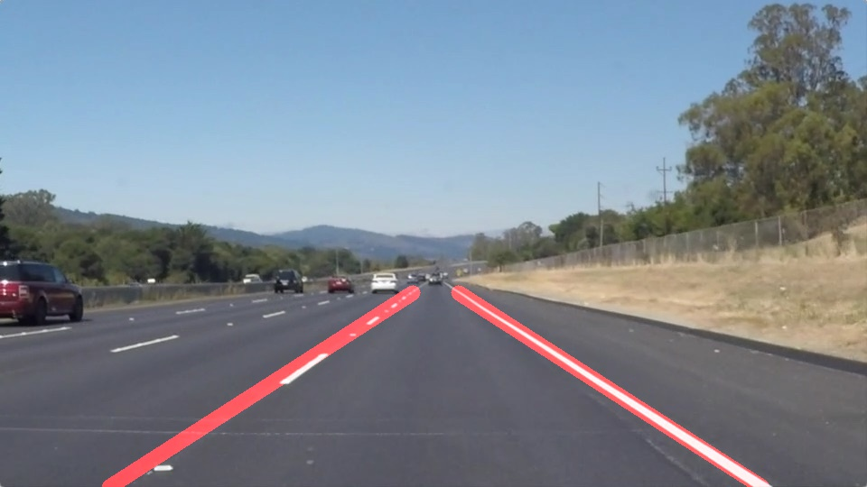
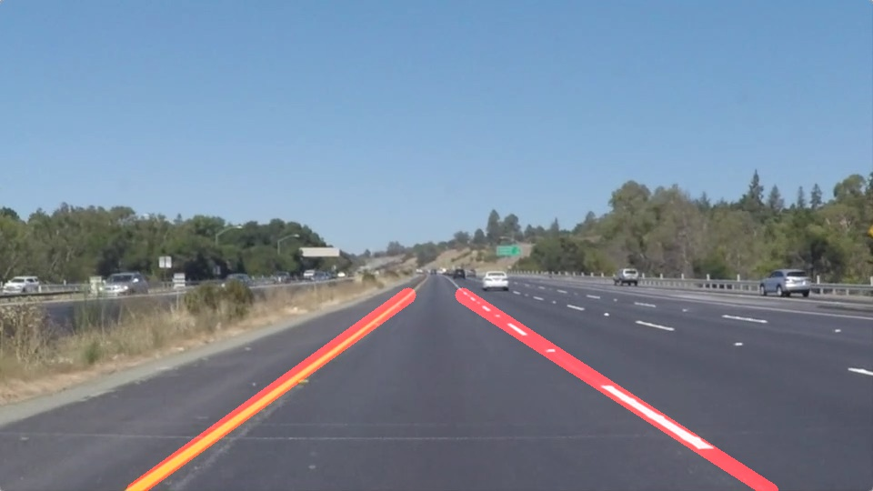
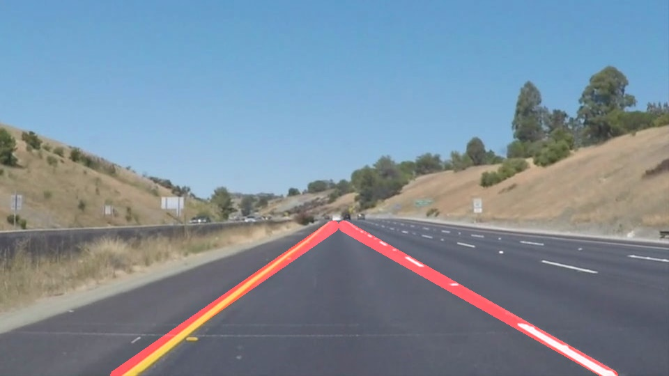

# **Finding Left and Right Lane Lines on the Road in Images and Videos** 

Overview
---

When we drive, we use our eyes to decide where to go.  The lines on the road that show us where the lanes are act as our constant reference for where to steer the vehicle.  Naturally, one of the first things we would like to do in developing a self-driving car is to automatically detect lane lines using an algorithm.Ik

The goal of this project is detecting of lane lines in road images and videos using Python and OpenCV.

## Pipeline
These are the steps to detect left and right lanes in a road image:

1- Convert color image to grayscale

2- Apply Gaussian smoothing

3- Edge Detection using Canny

4- Region selection using fillpoly and mask the image

5- Line detectin using Hough transoform on edge detected image

6- Finding left and right lanes (by slope ((y2-y1)/(x2-x1)))

7- Average the position of each of the lines and extrapolate to the top and bottom of the lane.
8- Draw lanes on the original image

9- Save the result (image or video)

## Test Images
These are the test images that we use to test the pipeline:

 

 

 

## Left and Right Lane Lines Detection

Following OpenCV functions are used in this project:

cv2.fillPoly() for regions selection

cv2.line() to draw lines on an image given endpoints

cv2.addWeighted() to coadd / overlay two images cv2.cvtColor() to grayscale or change color 

cv2.imwrite() to output images to file

cv2.bitwise_and() to apply a mask to an image

cv2.Canny() to detect edges

cv2.GaussianBlur() to smooth the image and remove noises

cv2.HoughLinesP() to detect lines in the edge image

## Lane detection results

Each test image is read and processed in lane finding pipeline

 

 

 

## Test on Videos

After drwing lanes over images, we use the pipeline to draw lanes on videos.

These are the two test videos:

    <video width="99%" height="540" autoplay loop muted markdown="1">
        <source src="test_videos_output/solidWhiteRight.mp4" type="video/mp4" markdown="1" >
    </video>

    <video width="99%" height="540" autoplay loop muted markdown="1">
        <source src="test_videos_output/solidYellowLeft.mp4" type="video/mp4" markdown="1" >
    </video>

## Conclusion 
In this project, we build a pipeline to detect left and right lanes on the road images and videos. There are several assumptions such as the car is between the lanes, the road is flat (not uphil or downhile), mostly lanes are straight ( a bit curvey at the end, it is day time and so on. In the proposed pipeline, first, we convert the color image to gray image to reduce the effect of colors and use canny edge detection to find the edges. Before applying canny, images are smoothed using a gaussian blur function to remove noises and smooth the edges. Since we know the car is between the lanes, a region of interest is defined to look for the lanes in a specific area. The output of the ROI function is a masked image. Now, hough transform is used to find lines in the masked area as we know the lanes are (mostly) located in the masked area. The output of hough transform is bunch of lines but we are looking for left and right lanes on the road. For this purpose, lanes are classified based on their slope (left lane has negative slope and right lane has positive slope) and then the lanes are extrapolated to show the path. Finally, the left and right lane lines are drawn on the original image. This pipeline works well for those assumptions, however, it may not applicable to other situations. For example, if road is not flat (uphil or downhil), it is rainy or night time, lanes are not straight, and car is not exactly between lanes, results are not accurate enough. There are several ways to improve the results, using perspective transformation and poly fiting lanes to handle curve lanes. Also, it can be useful to find horizontal line (between road and sky) to know where the lanes should be extended. 