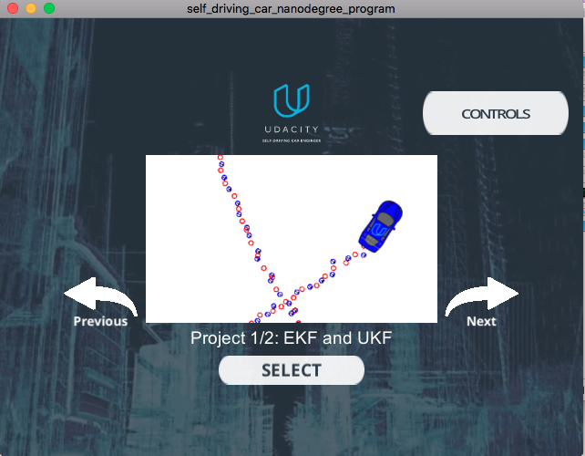
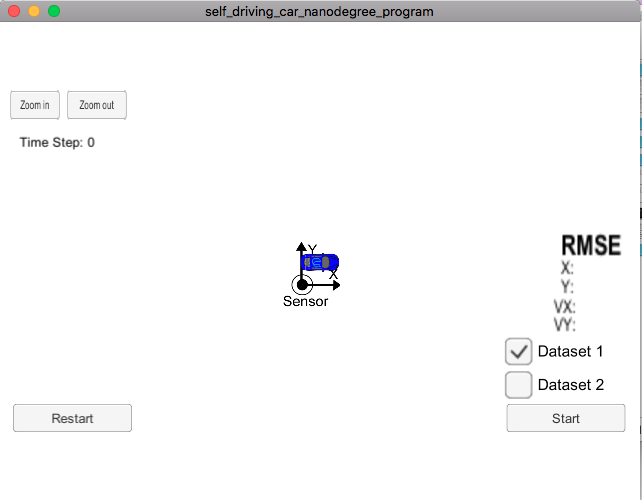
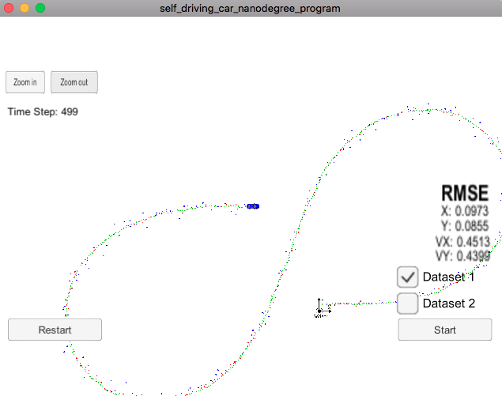
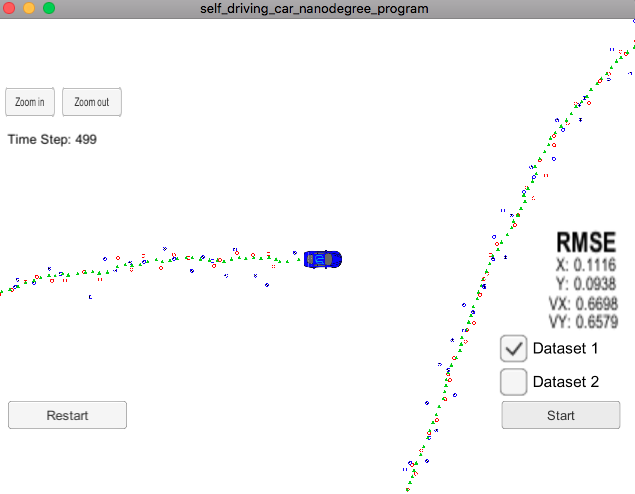
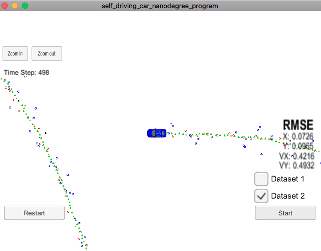

# Extended Kalman Filter Project 

Ray Khorsandi

May 2018

Self-Driving Car Engineer Nanodegree Program

## introduction

I am going to implement the extended Kalman filter in C++. Simulated lidar and radar measurements are provided detecting a bicycle that travels around your vehicle. I use a Kalman filter, lidar measurements and radar measurements to track the bicycle's position and velocity. Lidar measurements are red circles, radar measurements are blue circles with an arrow pointing in the direction of the observed angle, and estimation markers are green triangles.

In this project I utilized a kalman filter to estimate the state of a moving object of interest with noisy lidar and radar measurements. Passing the project requires obtaining RMSE values that are lower than the tolerance outlined in the project rubric. 

This project involves the Term 2 Simulator which can be downloaded [here](https://github.com/udacity/self-driving-car-sim/releases)

I used an open source package called uWebSocketIO. This package facilitates the same connection between the simulator and code that was used in the Term 1 Behavioral Cloning Project, but now with C++. The package does this by setting up a web socket server connection from the C++ program to the simulator, which acts as the host. In the project repository there are two scripts for installing uWebSocketIO - one for Linux and the other for macOS.

Note: Only uWebSocketIO branch e94b6e1, which the scripts reference, is compatible with the package installation.

Mac Installation:
From the project repository directory run the script: install-mac.sh

Once the install for uWebSocketIO is complete, the main program can be built and run by doing the following from the project top directory.

1. mkdir build
2. cd build
3. cmake ..
4. make
5. ./ExtendedKF

These are the main programs in this project:
src/FusionEKF.cpp, src/FusionEKF.h, kalman_filter.cpp, kalman_filter.h, tools.cpp, and tools.h

Here is the main protcol that main.cpp uses for uWebSocketIO in communicating with the simulator.

INPUT: values provided by the simulator to the c++ program

["sensor_measurement"] => the measurement that the simulator observed (either lidar or radar)

OUTPUT: values provided by the c++ program to the simulator

["estimate_x"] <= kalman filter estimated position x
["estimate_y"] <= kalman filter estimated position y
["rmse_x"]
["rmse_y"]
["rmse_vx"]
["rmse_vy"]

---

## Other Important Dependencies

* cmake >= 3.5
  * All OSes: [click here for installation instructions](https://cmake.org/install/)
* make >= 4.1 (Linux, Mac), 3.81 (Windows)
  * Linux: make is installed by default on most Linux distros
  * Mac: [install Xcode command line tools to get make](https://developer.apple.com/xcode/features/)
  * Windows: [Click here for installation instructions](http://gnuwin32.sourceforge.net/packages/make.htm)
* gcc/g++ >= 5.4
  * Linux: gcc / g++ is installed by default on most Linux distros
  * Mac: same deal as make - [install Xcode command line tools](https://developer.apple.com/xcode/features/)
  * Windows: recommend using [MinGW](http://www.mingw.org/)

## Basic Build Instructions

1. Clone this repo. https://github.com/udacity/CarND-Extended-Kalman-Filter-Project

2. Make a build directory: `mkdir build && cd build`
3. Compile: `cmake .. && make` 
   * On windows, you may need to run: `cmake .. -G "Unix Makefiles" && make`
4. Run it: `./ExtendedKF `

## Code Style

Using [Google's C++ style guide](https://google.github.io/styleguide/cppguide.html).

## Project Instructions and Rubric

Note:  project is buildable using
cmake and make!

A previously recorded project Q&A that you can watch [here](https://www.youtube.com/watch?v=J7WK9gEUltM&feature=youtu.be)!

## Explanation of the Data File
The github repo contains one data file:

obj_pose-laser-radar-synthetic-input.txt
Here is a screenshot of the first data file:

The simulator will be using this data file, and feed main.cpp values from it one line at a time.

Each row represents a sensor measurement where the first column tells you if the measurement comes from radar (R) or lidar (L).

For a row containing radar data, the columns are: sensor_type, rho_measured, phi_measured, rhodot_measured, timestamp, x_groundtruth, y_groundtruth, vx_groundtruth, vy_groundtruth, yaw_groundtruth, yawrate_groundtruth.

For a row containing lidar data, the columns are: sensor_type, x_measured, y_measured, timestamp, x_groundtruth, y_groundtruth, vx_groundtruth, vy_groundtruth, yaw_groundtruth, yawrate_groundtruth.

Whereas radar has three measurements (rho, phi, rhodot), lidar has two measurements (x, y).

## Overview of a Kalman Filter: Initialize, Predict, Update
Three main steps for programming a Kalman filter:

* Initializing Kalman filter variables

* Predicting where our object is going to be after a time step \Delta{t}Δt

* Updating where our object is based on sensor measurements

Then the prediction and update steps repeat themselves in a loop.

To measure how well our Kalman filter performs, we will then calculate root mean squared error comparing the Kalman filter results with the provided ground truth.

Files in the Github src Folder
The files I worked with are in the src folder of the github repository.

* main.cpp - communicates with the Term 2 Simulator receiving data measurements, calls a function to run the Kalman filter, calls a function to calculate RMSE

* FusionEKF.cpp - initializes the filter, calls the predict function, calls the update function

* kalman_filter.cpp- defines the predict function, the update function for lidar, and the update function for radar

* tools.cpp- function to calculate RMSE and the Jacobian matrix

## How the Files Relate to Each Other
1- Main.cpp reads in the data and sends a sensor measurement to FusionEKF.cpp

2- FusionEKF.cpp takes the sensor data and initializes variables and updates variables. The Kalman filter equations are not in this file. FusionEKF.cpp has a variable called ekf_, which is an instance of a KalmanFilter class. The ekf_ will hold the matrix and vector values. You will also use the ekf_ instance to call the predict and update equations.

3- The KalmanFilter class is defined in kalman_filter.cpp and kalman_filter.h. You will only need to modify 'kalman_filter.cpp', which contains functions for the prediction and update steps.

## Main.cpp
main.cpp reads in the sensor data line by line from the client and stores the data into a measurement object that it passes to the Kalman filter for processing. Also a ground truth list and an estimation list are used for tracking RMSE.

main.cpp is made up of several functions within main(), these all handle the uWebsocketIO communication between the simulator and it's self.

All the main code loops in h.onMessage(), to have access to intial variables that we created at the beginning of main(), we pass pointers as arguments into the header of h.onMessage().

// Create a Fusion EKF instance
  FusionEKF fusionEKF;

  // used to compute the RMSE later
  vector<VectorXd> estimations;
  vector<VectorXd> ground_truth;

  //Call the EKF-based fusion
  fusionEKF.ProcessMeasurement(meas_package);

The code is:

creating an instance of the FusionEKF class
Receiving the measurement data calling the ProcessMeasurement() function. ProcessMeasurement() is responsible for the initialization of the Kalman filter as well as calling the prediction and update steps of the Kalman filter.

The rest of main.cpp will output the following results to the simulator:

* estimation position
* calculated RMSE

## FusionEKF.cpp
initialize variables and matrices (x, F, H_laser, H_jacobian, P, etc.)

initialize the Kalman filter position vector with the first sensor measurements

modify the F and Q matrices prior to the prediction step based on the elapsed time between measurements

call the update step for either the lidar or radar sensor measurement. Because the update step for lidar and radar are slightly different, there are different functions for updating lidar and radar.

## KalmanFilter Class
kalman_filter.h defines the KalmanFilter class containing the x vector as well as the P, F, Q, H and R matrices. The KalmanFilter class also contains functions for the prediction step as well as the Kalman filter update step (lidar) and extended Kalman filter update step (radar).

Because lidar uses linear equations, the update step will use the basic Kalman filter equations. On the other hand, radar uses non-linear equations, so the update step involves linearizing the equations with the Jacobian matrix. The Update function will use the standard Kalman filter equations. The UpdateEKF will use the extended Kalman filter equations:

## Tools.cpp

functions to calculate root mean squared error and the Jacobian matrix:

More [info](https://classroom.udacity.com/nanodegrees/nd013/parts/40f38239-66b6-46ec-ae68-03afd8a601c8/modules/0949fca6-b379-42af-a919-ee50aa304e6a/lessons/f758c44c-5e40-4e01-93b5-1a82aa4e044f/concepts/6b343866-ff39-4ab7-9c1e-281214df6099).

## Results

